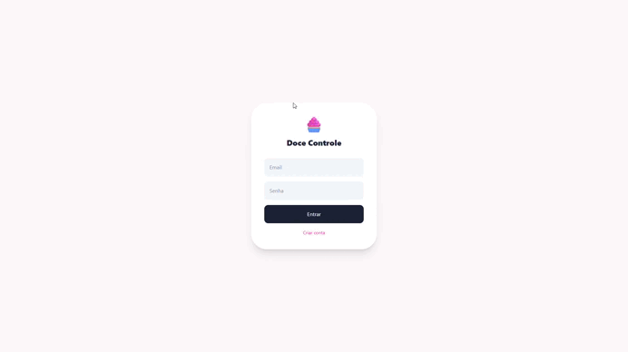
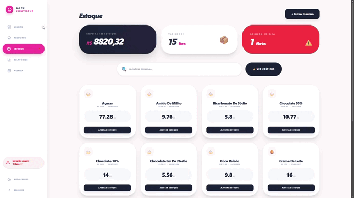
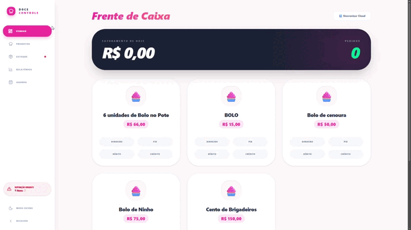

# 🧁 Doce Controle


> Sistema de gestão operacional e financeira para confeitarias independentes.


O **Doce Controle** foi desenvolvido para auxiliar confeiteiras autônomas no gerenciamento de estoque, vendas, custos, segurança de acesso e análise financeira, permitindo maior controle operacional e cálculo preciso do lucro real.


---


## 🚀 Tecnologias Utilizadas


React • Vite • Tailwind CSS • Supabase • JavaScript


* **Frontend:** React + Vite

* **Estilização:** Tailwind CSS

* **Banco de Dados:** Supabase

* **Autenticação:** Supabase Auth + Autenticação de Dois Fatores (2FA)

* **Gerenciamento de Estado:** React Hooks

* **Versionamento:** Git + GitHub


---


## 👥 Integrantes


| Integrante    | Responsabilidade                                                                 |

| ------------- | -------------------------------------------------------------------------------- |

| Lucas Jorge   | Líder Técnico, Engenharia de Software, Banco de Dados e Desenvolvimento Frontend |

| Letícia Rohod | Gestão de Produto, Levantamento de Requisitos, UI/UX e Regras de Negócio         |


---


## 🎯 Objetivo do MVP


O projeto busca resolver dificuldades comuns enfrentadas por confeitarias independentes:


* Controle manual de estoque;

* Dificuldade em calcular lucro real;

* Falta de acompanhamento de perdas;

* Ausência de indicadores financeiros;

* Falta de controle centralizado das operações.


---


## 🔄 Fluxo Principal do Sistema


```text

Cadastro de Insumo

        ↓

Ficha Técnica

        ↓

Produção

        ↓

Venda

        ↓

Baixa automática do estoque

        ↓

Cálculo do Lucro Real

        ↓

Relatórios Financeiros

```


Este fluxo representa o eixo central do MVP e conecta a operação ao resultado financeiro.


---


## 🔐 Autenticação e Segurança


O sistema conta com autenticação de usuários integrada ao Supabase, incluindo autenticação de dois fatores (2FA) para aumentar a segurança de acesso às informações da confeitaria.


### Funcionalidades de Segurança


* Cadastro de usuários;

* Login com e-mail e senha;

* Recuperação de senha;

* Proteção de rotas autenticadas;

* Autenticação de Dois Fatores (2FA);

* Gerenciamento seguro de sessões;

* Controle de acesso às funcionalidades do sistema.


### Fluxo de Autenticação


```text

Usuário realiza login

          ↓

Validação de e-mail e senha

          ↓

Solicitação do código OTP

          ↓

Validação do segundo fator

          ↓

Acesso autorizado ao sistema

```


### Benefícios


* Maior proteção contra acessos não autorizados;

* Segurança adicional para dados financeiros;

* Redução dos riscos causados por vazamento de senhas;

* Aplicação alinhada às boas práticas de segurança web.


---


## 📷 Demonstração do Sistema


### Login





### Estoque





### Frente de Caixa





### Relatórios


---


## 🗄️ Estrutura do Banco de Dados


### Tabela: insumos


| Campo            | Tipo    |

| ---------------- | ------- |

| id               | UUID    |

| nome             | TEXT    |

| quantidade_atual | NUMERIC |

| preco            | NUMERIC |


Responsável pelo armazenamento dos ingredientes e controle do estoque.


---


### Tabela: produtos


| Campo       | Tipo    |

| ----------- | ------- |

| id          | UUID    |

| nome        | TEXT    |

| preco_venda | NUMERIC |


Armazena os produtos disponíveis para venda.


---


### Tabela: ingredientes_produto


Tabela responsável pela ficha técnica dos produtos.


| Campo                | Tipo    |

| -------------------- | ------- |

| produto_id           | UUID    |

| insumo_id            | UUID    |

| quantidade_utilizada | NUMERIC |


---


### Tabela: vendas


| Campo      | Tipo    |

| ---------- | ------- |

| id         | BIGINT  |

| produto_id | UUID    |

| quantidade | INTEGER |

| total      | NUMERIC |


Responsável pelo registro das vendas realizadas.


---


### Tabela: perdas


| Campo              | Tipo    |

| ------------------ | ------- |

| id                 | BIGINT  |

| insumo_id          | UUID    |

| quantidade_perdida | NUMERIC |

| custo_prejuizo     | NUMERIC |


Responsável pelo controle de desperdícios e prejuízos.


---


## 📈 Regras de Negócio


### CMV (Custo da Mercadoria Vendida)


O lucro real considera os custos dos ingredientes utilizados na produção.


**Fórmula:**


```text

Lucro Real = Total Vendido − Σ(Quantidade Utilizada × Preço do Insumo)

```


---


### Controle de Perdas


Sempre que uma perda é registrada:


* O estoque é atualizado;

* O prejuízo é calculado automaticamente;

* O impacto financeiro é registrado;

* Os relatórios são atualizados.


---


### Baixa Automática de Estoque


Ao registrar uma venda:


* O sistema consulta a ficha técnica do produto;

* Identifica os insumos utilizados;

* Calcula as quantidades consumidas;

* Atualiza automaticamente o estoque.


---


## 📊 Funcionalidades do Sistema


### Gestão de Estoque


* Cadastro de insumos;

* Controle de quantidades;

* Atualização automática após vendas;

* Registro de perdas.


### Frente de Caixa


* Registro de vendas;

* Cálculo automático de valores;

* Controle de movimentação financeira.


### Relatórios


* Faturamento;

* Lucro estimado;

* Custos de produção;

* Controle de perdas;

* Indicadores financeiros.


### Gestão de Produtos


* Cadastro de produtos;

* Associação com ficha técnica;

* Precificação dos itens vendidos.


---


## 🧪 Plano de Testes


| Módulo          | Cenário                           | Resultado  |

| --------------- | --------------------------------- | ---------- |

| Estoque         | Cadastro de ingrediente           | ✅ Aprovado |

| Estoque         | Atualização automática de estoque | ✅ Aprovado |

| Frente de Caixa | Registro de venda                 | ✅ Aprovado |

| Perdas          | Registro de descarte              | ✅ Aprovado |

| Relatórios      | Atualização financeira            | ✅ Aprovado |

| Autenticação    | Login de usuário                  | ✅ Aprovado |

| Autenticação    | Recuperação de senha              | ✅ Aprovado |

| Segurança       | Verificação 2FA                   | ✅ Aprovado |


---


## 📁 Estrutura do Projeto


```bash

src/

├── assets/

├── components/

├── hooks/

├── pages/

├── services/

├── supabase/

├── App.jsx

├── main.jsx

└── index.css

```


---


## ⚙️ Configuração do Ambiente


### 1 — Clone o projeto


```bash

git clone URL_DO_REPOSITORIO

```


### 2 — Acesse a pasta do projeto


```bash

cd doce-controle

```


### 3 — Instale as dependências


```bash

npm install

```


### 4 — Configure as variáveis de ambiente


Crie um arquivo `.env` na raiz do projeto:


```env

VITE_SUPABASE_URL=sua_url

VITE_SUPABASE_ANON_KEY=sua_chave

```


### 5 — Execute o projeto


```bash

npm run dev

```


### 6 — Build de Produção


```bash

npm run build

```


---


## 📌 Próximas Melhorias


* [x] Autenticação de Dois Fatores (2FA)

* [ ] Dashboard financeiro avançado

* [ ] Exportação de relatórios em PDF

* [ ] Controle de metas financeiras

* [ ] Histórico de produção

* [ ] Notificações de estoque baixo

* [ ] Aplicação mobile

* [ ] Integração com emissão de pedidos


---


## 📚 Documentação Técnica


O projeto foi desenvolvido seguindo princípios de Engenharia de Software, contemplando:


* Levantamento e análise de requisitos;

* Modelagem de banco de dados;

* Arquitetura cliente-servidor;

* Controle de versão com Git;

* Desenvolvimento incremental baseado em MVP;

* Testes funcionais dos módulos principais;

* Integração com serviços em nuvem utilizando Supabase.


---


## 📄 Licença


Projeto acadêmico desenvolvido para fins educacionais.


Todos os direitos reservados aos autores do projeto.
